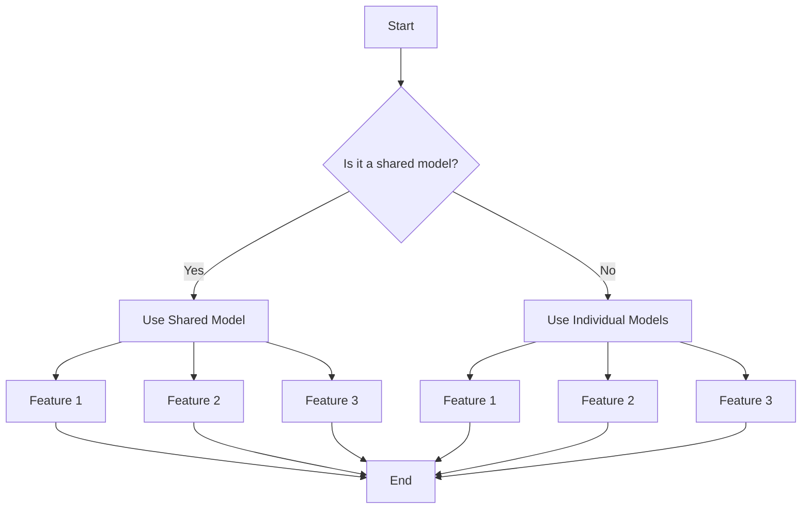

```mermaid
flowchart TD
    A[Start] --> B{Is it a shared model?}
    B -- Yes --> C[Use Shared Model]
    C --> D[Feature 1]
    C --> E[Feature 2]
    C --> F[Feature 3]
    B -- No --> G[Use Individual Models]
    G --> H[Feature 1]
    G --> I[Feature 2]
    G --> J[Feature 3]
    D --> K[End]
    E --> K
    F --> K
    H --> K
    I --> K
    J --> K
```