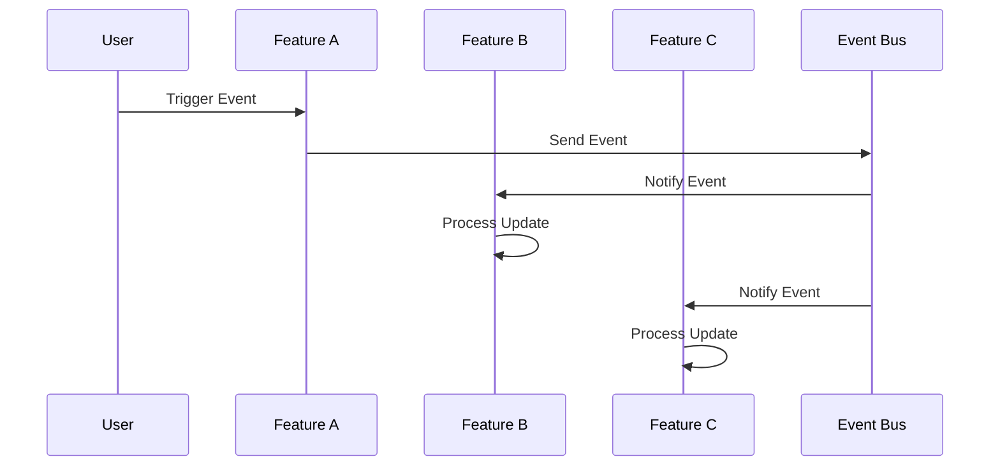

# Event Flow and Sequence Diagram for Auto-Update between Features

## Event Flow

- **User Action**: A user triggers an event (e.g., saving data).
- **Feature A**: Sends an event to the event bus.
- **Event Bus**: Receives the event and distributes it to all relevant features.
- **Feature B**: Listens for the event and initiates its own update process.
- **Feature C**: Also listens for the event and updates accordingly.
- **Feedback Loop**: Each feature can send feedback through events as well.

## Sequence Diagram

