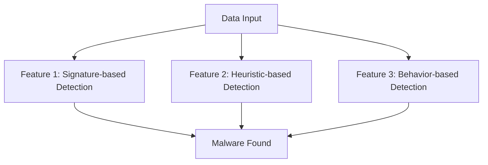

```mermaid
flowchart TD
    A[Data Input] --> B[Feature 1: Signature-based Detection]
    A --> C[Feature 2: Heuristic-based Detection]
    A --> D[Feature 3: Behavior-based Detection]
    B --> E[Malware Found]
    C --> E
    D --> E
```